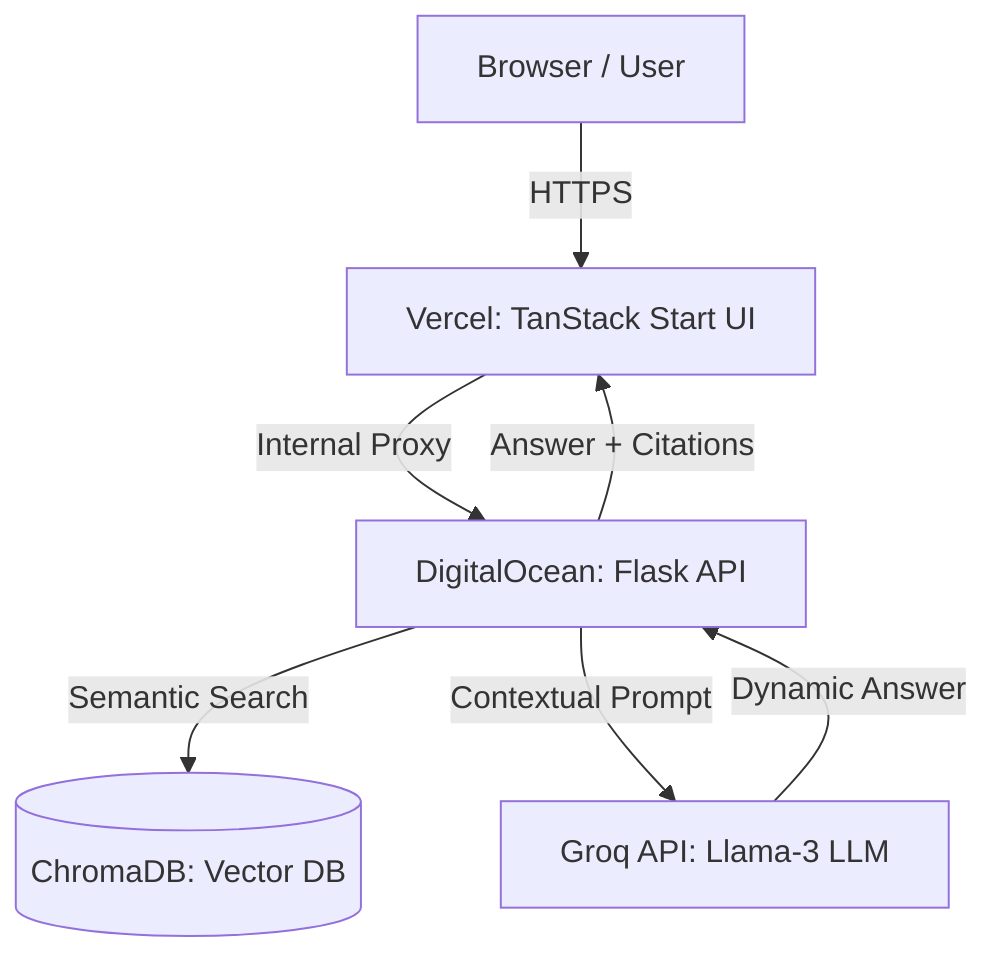

# System Architecture – Anantha Library

Anantha Library uses a decoupled, three-tier architecture designed to provide a seamless conversational experience while ensuring user privacy and high performance.

---

## 🏗️ 1. High-Level Overview

The system is split into a **Frontend UI** (hosted on Vercel) and a **Backend AI Service** (hosted on a DigitalOcean droplet). The connection is handled via a server-side proxy in TanStack Start to ensure API keys and backend URLs remain secure.

---

## 🧠 2. The RAG Pipeline (Retrieval-Augmented Generation)

The core "brain" of Anantha Library is the RAG pipeline. Here is how a user question is processed:

1.  **Input:** User asks: *"I feel overwhelmed by my responsibilities."*
2.  **Embedding:** The backend uses `sentence-transformers` to convert this text into a 384-dimensional mathematical vector.
3.  **Retrieval:** ChromaDB searches its index to find the 5 verses whose vectors are most "similar" to the user's question (e.g., verses about *Karma Yoga* or *Duty*).
4.  **Augmentation:** The backend builds a specialized prompt:
    > "You are Anantha, a wise guide. User asks: [User Question]. Use these Gita verses as context: [Verse 1, Verse 2...]. Answer the user with compassion."
5.  **Generation:** This prompt is sent to the **Groq API**. The LLM (Llama-3) generates a human-like response *using only the provided verses*.
6.  **Response:** The UI displays the AI's answer alongside clickable **Citations** that lead the user back to the source verses.

---

## 🗄️ 3. Data Architecture

-   **Vector Storage:** `ChromaDB` stores the 701 verses of the Bhagavad Gita as high-dimensional vectors. This allows for "meaning-based" searching rather than just "keyword-based" searching.
-   **Local Storage:** User data (saved verses, journal entries, streaks, and theme settings) never leaves the user's browser. It is stored in `localStorage` for maximum privacy.

---

## 🛡️ 4. Security & Performance

-   **API Proxying:** The frontend does not call the DigitalOcean droplet directly from the browser. Instead, it uses a **Server Side Handler** (`ai-proxy.server.ts`). This hides the backend IP and credentials from the public internet.
-   **Rate Limiting:** The backend implements a **Sliding-Window Rate Limiter**. If the Groq API limit is reached (30 requests per minute), the backend will automatically "pause" and wait for a slot to open up rather than returning an error to the user.
-   **Graceful Degradation:** If the backend is unreachable, the frontend automatically falls back to a "Mock Mode," using a local copy of the verses (`verses.json`) to provide basic search functionality.

---

## ⚙️ 5. Deployment

-   **UI:** Continuous deployment via **Vercel**.
-   **Backend:** Dockerized and managed on **DigitalOcean**.
-   **API:** Groq (Cloud-based inference for high speed).
